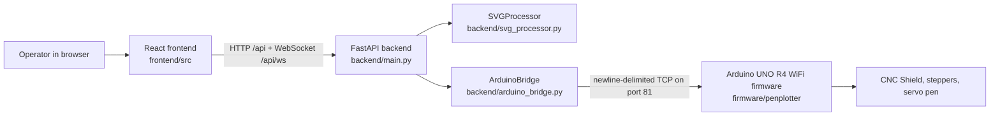

# Architecture

This document describes the current running architecture in the repository source.

## System Context



## Layer Responsibilities

| Layer | Files | Current responsibility |
| --- | --- | --- |
| Frontend | [`frontend/src/App.tsx`](../frontend/src/App.tsx), [`frontend/src/components/`](../frontend/src/components), [`frontend/src/api.ts`](../frontend/src/api.ts) | User workflow, SVG upload, preview rendering, positioning controls, optimization controls, plot controls, jog controls, settings, live status display. |
| Backend API | [`backend/main.py`](../backend/main.py), [`backend/config.py`](../backend/config.py) | FastAPI app, upload handling, profile persistence, request validation, REST endpoints, browser status WebSocket. |
| SVG pipeline | [`backend/svg_processor.py`](../backend/svg_processor.py) | SVG parsing, plottable filtering, path sampling, simplification, scaling, path ordering, arc/Bezier/ellipse handling, G-code generation. |
| Arduino bridge | [`backend/arduino_bridge.py`](../backend/arduino_bridge.py) | Async TCP connection to firmware, command streaming, ok/ready flow control, state/progress tracking, status broadcasting callback. |
| Firmware | [`firmware/penplotter/penplotter.ino`](../firmware/penplotter/penplotter.ino), headers | Wi-Fi/serial command intake, G-code parsing, special command handling, motion execution, direct step/dir pin control, pen servo. |

## Main User Flows

### Upload And Preview

1. The operator picks an `.svg` in `FileUpload`.
2. `api.uploadSvg()` posts multipart form data to `POST /api/upload`.
3. The backend saves the file under `uploads/<filename>`.
4. `SVGProcessor.get_preview_paths()` parses the SVG, filters plottable paths, samples points, scales and positions them, and sorts paths.
5. The frontend stores `paths`, `bed`, `filename`, and `dimensions`.
6. `SvgPreview` renders the bed, optional artboard, SVG canvas bounds, travel moves, drawing paths, and current or preview pen position.

### Reposition And Optimize

1. `PositionControls` changes alignment, margin, scale mode, target dimensions, or artboard settings.
2. `OptimizationControls` changes `none`, `greedy`, or `greedy_flip`.
3. Both call `POST /api/reposition`.
4. The backend reruns preview generation with the selected settings.
5. The frontend replaces the preview paths and resets the preview timeline position.

### Start Plot

1. `ControlPanel` calls `POST /api/plotter/plot`.
2. The backend runs `SVGProcessor.process_svg()` with the same positioning and optimization settings.
3. The backend generates G-code and calls `ArduinoBridge.start_plot()`.
4. `ArduinoBridge` strips comments/empty lines, enters `plotting`, and sends up to 8 lines ahead.
5. The firmware executes commands and responds with `ok`, `ready N`, `error ...`, or position/status messages.
6. The bridge updates progress and broadcasts status to browser clients over `/api/ws`.

### Manual Control

Manual controls are direct backend-to-firmware commands:

- Jogging sends `G91`, `G1 <axis><distance> F<rapid>`, then `G90`.
- Home sends `G28`.
- Pen up/down sends `M5` and `M3`.
- Set home sends `G92 X0 Y0` and then `M114`.
- Soft limits can be disabled temporarily while the set-home modal is open.

## Runtime State

| State | Owner | Storage |
| --- | --- | --- |
| Uploaded SVG file | Backend | `backend/uploads/` when backend is run from `backend/`; ignored by git. |
| Profiles and active profile | Backend | `profiles.json`; ignored by git. |
| Active Arduino connection | Backend | In-memory singleton `arduino` in `backend/main.py`. |
| Plot progress | Backend bridge | In-memory `PlotterStatus`. |
| UI selection and preview | Frontend | React state in `App`. |
| Sidebar panel order | Frontend | Browser `localStorage` key `sidebar-panel-order`. |
| Current machine position | Firmware | Volatile RAM fields `currentX`, `currentY`, `currentZ`. |
| Soft limit/easing settings | Firmware | Volatile RAM, updated by `$LIMITS`, `$SOFTLIMITS`, `$EASING`. |

There is no database, no durable job queue, and no persisted firmware state.

## Protocol Boundaries

### Browser To Backend

The frontend uses REST endpoints under `/api` and a browser WebSocket at `/api/ws`. In development, Vite proxies `/api` to `http://localhost:8000` with `ws: true`.

### Backend To Firmware

`ArduinoBridge.connect()` uses `asyncio.open_connection(host, port)`. This is a raw TCP stream with newline-delimited messages. It is not a browser WebSocket handshake.

The line protocol is ok-based:

```text
backend -> firmware: G1 X10.000 Y20.000 F5000
firmware -> backend: ok
backend -> firmware: next line
```

The bridge can send up to 8 lines ahead. The firmware separately has a 16-line receive buffer and emits `ready <free_slots>` when its buffer is low.

### Serial To Firmware

The firmware also reads newline-delimited commands from USB serial at `115200`. Serial uses the same parser and special commands as Wi-Fi.

## Notable Current Mismatches

The reconciled docs in this folder describe current source. A few older statements still exist in the top-level README or in source comments:

- Current SVG processing is custom `svgpathtools` logic, not `vpype`.
- Current firmware uses direct `digitalWrite()` stepping and `Servo`, not MobaTools.
- Current backend-to-firmware transport is raw TCP, not true WebSocket.
- Current frontend development port is `9999`, not `3000`.
- Current firmware supports G5, G6, G92, and several `$...` configuration commands beyond the README table.

These are documented in more detail in [status-quo-audit.md](status-quo-audit.md).
