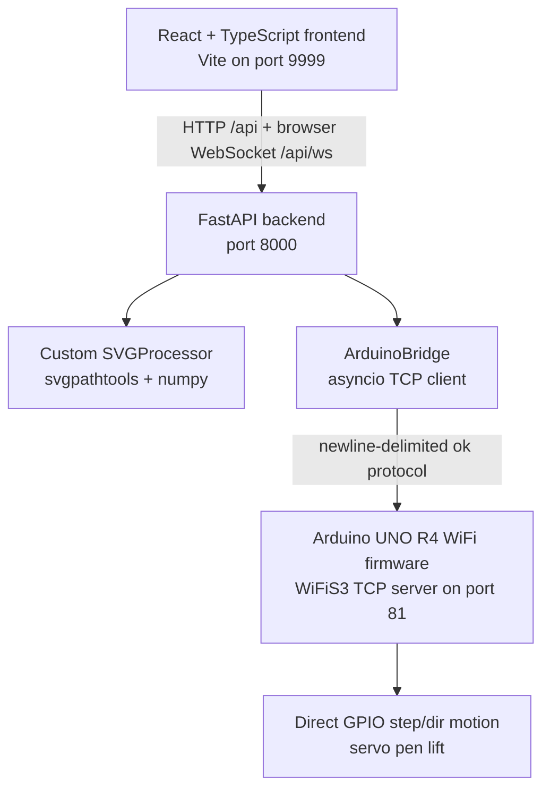

# Pen Plotter Current Strategy

This file reconciles the original development strategy with the current source. It is a planning bridge: use [README.md](README.md) as the documentation index, [architecture.md](architecture.md) for the runtime model, and [status-quo-audit.md](status-quo-audit.md) for open questions.

## Current Architecture

## What Changed From The Original Plan

| Original direction | Current implementation |
| --- | --- |
| `vpype` and `vpype-gcode` for SVG conversion | Custom `SVGProcessor` built on `svgpathtools` and `numpy`. |
| WebSocket bridge from backend to Arduino | Raw newline-delimited TCP stream using `asyncio.open_connection()` and `WiFiServer`. |
| MobaTools for stepper control | Direct `digitalWrite()` step/dir pulses in `MotionPlanner`. |
| Basic G-code subset | Extended dialect with `G2`, `G3`, `G5`, `G6`, `G92`, and `$...` configuration commands. |
| Frontend on port `3000` | Vite dev server on port `9999`. |

## Current Frontend Strategy

The frontend is an operator dashboard:

- Keep upload, preview, positioning, optimization, header plot actions, manual jogging, and settings access in one operational screen.
- Keep preview and plot settings aligned so the plotted output matches what the operator saw.
- Preserve bottom-left plotter coordinates in the preview.
- Keep setup and machine sidebars separate; setup panels remain collapsible/reorderable and machine controls stay focused on manual motion.
- Keep settings in a header-triggered dialog instead of consuming right-sidebar space.

Important docs:

- [frontend.md](frontend.md)
- [svg-processing.md](svg-processing.md)

## Current Backend Strategy

The backend is a local control service:

- Accept SVG uploads and store them under the configured upload directory.
- Convert SVGs to preview paths and G-code with current profile settings.
- Persist profiles in a local JSON file.
- Hold one in-memory Arduino bridge singleton.
- Broadcast plotter status to browser clients over `/api/ws`.

Important docs:

- [backend-api.md](backend-api.md)
- [svg-processing.md](svg-processing.md)

## Current Firmware Strategy

The firmware is a purpose-built plotter runtime:

- Accept newline-delimited commands over Wi-Fi TCP and serial.
- Parse a compact G-code dialect.
- Drive X, Y1, and Y2 step/dir pins directly.
- Use a servo for pen up/down.
- Treat homing as a return to the current logical origin, not a switch-probing cycle.
- Enforce soft limits by clamping coordinates when enabled.

Important docs:

- [firmware.md](firmware.md)
- [hardware-motion.md](hardware-motion.md)
- [device.md](device.md)

## Candidate Foundations

Treat these as likely foundational until deliberately redesigned:

- Millimeter units.
- Bottom-left plotter origin.
- Bed maximum of `426 x 599` mm.
- Shared preview/plot placement settings.
- Ok-based line protocol.
- Dual Y motor synchronization.
- Servo pen lift through `M3` and `M5`.

## Candidate Improvements

These are the main improvement tracks now that the current state is documented:

1. Remove hardcoded Wi-Fi credentials from firmware.
2. Decide whether raw TCP is the intended Arduino transport or whether a true WebSocket protocol is desired.
3. Align UI speed settings with firmware behavior.
4. Add reliable in-motion stop/pause polling inside the stepping loop.
5. Add backend SVG fixture tests for scaling, path ordering, and G-code generation.
6. Add firmware parser/motion tests or a simulator harness.
7. Update the top-level README after the documentation baseline is accepted.
